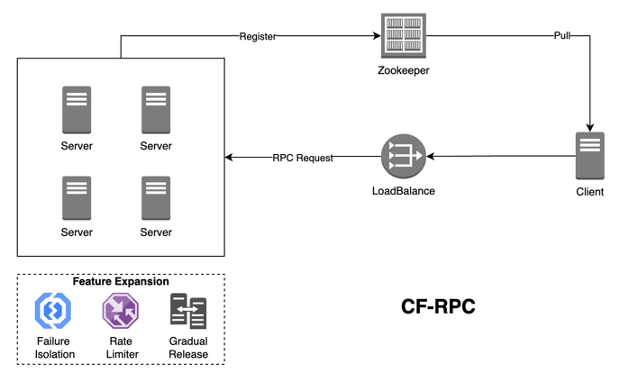

# CF-RPC
## 1. Introduction
设计一个远程RPC调用框架，支持多种序列化方式

## 设计前
- 需求
- 拓展性
- 高可用
- 性能
- 安全
- 可维护性
- 通用性
- 灵活性
- 用户体验
- 数据管理
- 成本
- 技术栈
- 团队协作

### CF-RPC-CORE
- 定义了request和response的数据结构
- 定义了rpc的接口

### 开发日志
- [x] 定义request和response 数据结构
- [x] 加载自定义注解的服务
- [x] 启动时自定义注解加载代理对象
- [x] 动态代理实现消费端的http请求
- [x] 支持方法重载 
- [x] json 序列化
- [x] 处理基础类型参数
- [x] 重构工具类
- [x] 新增rpc元数据结构
- [x] 重构负载均衡、注册中心
- [ ] 处理数组、List、Map的类型
- [ ] 支持接口多个实现类调用
- [ ] 压力测试
- [ ] 支持netty实现远程调用

为什么要做类型转换？
因为RpcRequest中的args是Object类型，需要根据方法的参数类型进行转换；

1. 跨语言兼容性  
   RPC（远程过程调用）通常用于不同服务之间的通信，这些服务可能是用不同编程语言编写的。不同语言对数据类型的支持和定义可能不同。例如，一个语言中的日期类型可能在另一个语言中没有直接对应。通过考虑多种数据类型转换，可以确保不同服务间的无缝通信。

2. 网络序列化  
   在RPC调用中，数据需要在网络上进行传输。这通常涉及到将复杂数据结构（如对象、列表、映射等）序列化为一种格式（如JSON、XML、Protobuf等），然后在接收方反序列化回原始数据结构。不同的数据类型在序列化和反序列化过程中的处理方式可能不同，考虑多种数据类型转换可以确保这一过程的准确性和高效性。

3. 灵活性和扩展性  
   考虑到多种数据类型转换，可以让RPC框架更灵活，更容易扩展。随着时间的推移，可能需要支持新的数据类型或改变数据传输的格式。如果框架从一开始就设计有考虑到多种数据类型的转换，那么添加新的支持或修改现有的实现会更加容易。

4. 减少客户端和服务端的耦合  
   通过抽象化数据类型的转换过程，可以减少客户端和服务端之间的耦合。客户端和服务端可以独立地演化和变化，只要它们遵循相同的通信协议和数据转换规则。这种解耦可以提高系统的可维护性和可扩展性。

5. 提高错误处理能力  
   在多种数据类型转换的过程中，可以集成错误检测和处理机制，比如类型不匹配、数据丢失或损坏等问题。这有助于提高系统的鲁棒性，确保数据的准确性和完整性。

6. 用户体验和性能优化  
   正确处理多种数据类型转换可以优化数据传输的大小和速度，进而优化性能。例如，通过选择更紧凑的序列化格式或仅传输必要的数据字段，可以减少网络延迟，提供更快的响应时间，从而改善用户体验。

总之，考虑多种数据类型的转换是RPC调用中的一个关键组成部分，它影响到系统的兼容性、扩展性、稳定性和性能。

为什么要

通过扫描@CFConsumer 和 @CFProvider 注解，自动注册服务

## 数据结构
### RpcRequest
service：请求服务
method：请求方法
args：参数
### RpcResponse
status: 请求是否成功
data：请求响应数据
exception：异常
### 核心注解

### 功能支持
1. 负载均衡
2. 故障隔离
3. 灰度发布
4. 限流

### 待琢磨
1. 类型转换里面，如何处理Map， 和List， 里面设计List 里面包装对象，以及各个类的包装层级

## 高可用
1. 有节点宕机的时候，通过多个provider集群+注册中心，可以运行期保障服务整体的可用；
2. 有节点偶尔异常，但是没宕机，我们可以通过重试+LB重新选择节点，实现这次调用的成功；
3. 有节点在一段时间内异常（这个实例上有很多服务，其中个别服务比如说）、没宕机，甚至其他服务一直是正常； ==》 故障隔离
   - 探活好了，就可以做故障恢复
   - 每次定时探活我们放一笔流量，看看这个服务是否恢复了
4. 

### 灰度发布
 - 流量调度

对于InstanceMeta 添加属性机房、灰度、单元属性；